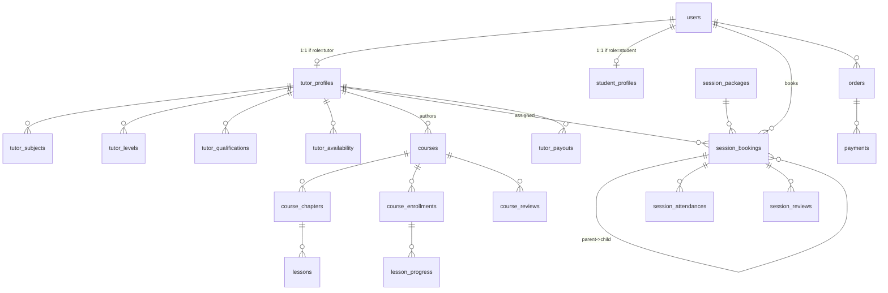

<!-- _class: lead -->
<!-- _paginate: false -->

# Tables + Relationships
# ERD 19 Bảng

### Khóa 2-3 — Video 49

**Cardinality · FK · Walk through full schema**

> ERD là bản đồ — đọc đúng bản đồ, code đi đúng đường

---

## Slide 2 — Mục tiêu video này

Sau 25 phút, bạn sẽ:

- ✅ Nắm 19 bảng domain Tutor365
- ✅ Hiểu **cardinality** mỗi relationship
- ✅ Phân biệt **1:1, 1:N, N:N**
- ✅ Tự vẽ lại ERD trên giấy
- ✅ Biết **bảng phụ trợ** (audit_logs, pricing_rules, refresh_tokens)
- ✅ Naming convention cho FK

> 🎯 Cuối video: bạn vẽ được ERD Tutor365 không cần tham khảo

---

## Slide 3 — ERD high-level



---

## Slide 4 — 19 bảng domain

| # | Table | Mô tả |
|---|-------|-------|
| 1 | `users` | Tất cả user (3 role) |
| 2 | `tutor_profiles` | 1:1 với users role=tutor |
| 3 | `student_profiles` | 1:1 với users role=student |
| 4 | `subjects` | Master data 12 môn |
| 5 | `levels` | Master data 17 trình độ |
| 6 | `qualifications` | Master data 20 bằng cấp |
| 7 | `tutor_subjects` | N:N tutor × subject |
| 8 | `tutor_levels` | N:N tutor × level |
| 9 | `tutor_qualifications` | N:N tutor × qualification (+certificate) |
| 10 | `tutor_availability` | 1:N tutor → slot recurring |
| 11 | `courses` | 1:N tutor → course |
| 12 | `course_chapters` | 1:N course → chapter |
| 13 | `lessons` | 1:N chapter → lesson |
| 14 | `course_enrollments` | N:N student × course (paid) |
| 15 | `lesson_progress` | N:N enrollment × lesson |
| 16 | `course_reviews` | 1:1 (course, student) max |
| 17 | `session_packages` | Master data single/combo |
| 18 | `session_bookings` | Live tutoring booking |
| 19 | `session_attendances` | 1:N booking → attendance |
| 20 | `session_reviews` | 1:1 (booking, student) |
| 21 | `orders` | 1:N user → order |
| 22 | `payments` | 1:N order → payment attempt |
| 23 | `tutor_payouts` | 1:N tutor × month |

> 💡 23 bảng tổng — 19 "domain chính" + master data + transaction.

---

## Slide 5 — Bảng phụ trợ (ngoài ERD chính)

| Table | Mục đích |
|-------|----------|
| `audit_logs` | Track mọi action (compliance, debug) |
| `pricing_rules` | Configurable rates, percent |
| `refresh_tokens` | JWT refresh whitelist |
| `email_verify_tokens` | Verify email TTL |
| `calendar_tokens` | iCal feed access |
| `idempotency_keys` | Idempotency-Key cache |
| `notifications` | In-app + email queue |

Total ≈ 30 bảng. ERD core 19+ domain quan trọng.

---

## Slide 6 — Cardinality: 1:1

### `users ↔ tutor_profiles`

```
1 user (role=tutor) ↔ 1 tutor_profile (PK = userId = FK)

Vì sao tách bảng?
  ✅ tutor_profile chỉ exists nếu role=tutor
  ✅ Tránh NULL columns ở users
  ✅ Sửa bio tutor không lock users row

Implementation:
  PK của tutor_profiles = userId (FK)
  → enforce 1:1
```

```sql
CREATE TABLE tutor_profiles (
  user_id UUID PRIMARY KEY REFERENCES users(id) ON DELETE CASCADE,
  bio TEXT,
  approve_status TEXT NOT NULL,
  ...
);
```

---

## Slide 7 — Cardinality: 1:N

### `tutor → courses`

```
1 tutor (user) → N courses

Implementation:
  courses.tutor_id REFERENCES users(id)
  KHÔNG unique constraint trên tutor_id
```

```sql
CREATE TABLE courses (
  id UUID PRIMARY KEY,
  tutor_id UUID NOT NULL REFERENCES users(id),
  ...
);
CREATE INDEX idx_courses_tutor ON courses (tutor_id);
```

---

## Slide 8 — Cardinality: N:N

### `tutor ↔ subjects` qua `tutor_subjects`

```
Join table với composite PK

CREATE TABLE tutor_subjects (
  tutor_id UUID NOT NULL REFERENCES tutor_profiles(user_id) ON DELETE CASCADE,
  subject_id UUID NOT NULL REFERENCES subjects(id) ON DELETE CASCADE,
  created_at TIMESTAMPTZ DEFAULT NOW(),
  PRIMARY KEY (tutor_id, subject_id)
);
```

**Composite PK = 2 thuộc tính:**

- ✅ Tự dedupe — không add 2 lần
- ✅ Index cover query 2 chiều
- ✅ Không cần id riêng

---

## Slide 9 — Cardinality: Self-reference

### `session_bookings → session_bookings` (parent/child combo)

```sql
CREATE TABLE session_bookings (
  id UUID PRIMARY KEY,
  parent_booking_id UUID REFERENCES session_bookings(id) ON DELETE CASCADE,
  ...
);
```

- Parent có `parent_booking_id = NULL` + `recurrence_rule != null`
- Child có `parent_booking_id = parent.id`

**Query:**

```sql
-- Children của parent
SELECT * FROM session_bookings WHERE parent_booking_id = :pid;

-- Parent của child
SELECT * FROM session_bookings WHERE id = (
  SELECT parent_booking_id FROM session_bookings WHERE id = :cid
);
```

---

## Slide 10 — FK options ON DELETE

```sql
-- CASCADE: xoá user → xoá tutor_profile theo
ON DELETE CASCADE

-- RESTRICT: không cho xoá course nếu còn enrollment
ON DELETE RESTRICT

-- SET NULL: course xoá → enrollment.course_id = null
ON DELETE SET NULL

-- NO ACTION: default, deferred check
```

**Tutor365 chọn:**

- `CASCADE` cho child entity (profile, chapter, lesson)
- `RESTRICT` cho referential integrity quan trọng (course có enrollment không xoá được)
- `SET NULL` cho optional FK (assigned tutor có thể null)

---

## Slide 11 — Naming convention

```
Table: snake_case plural
  users, courses, session_bookings, tutor_subjects

Column: snake_case
  full_name, created_at, tutor_id

Primary key: id (UUID)
Foreign key: <singular>_id
  tutor_id (FK to users.id where role=tutor)
  parent_booking_id

Boolean: is_*
  is_active, is_free_preview, is_hidden

Date/Time: 
  created_at, updated_at, paid_at, expires_at
  Format: TIMESTAMPTZ (with time zone)

Status enum: <table>_status text
  approve_status, booking_status
  → CHECK constraint enforce values
```

---

## Slide 12 — Composite FK

### tutor_subjects FK chain

```sql
CREATE TABLE tutor_subjects (
  tutor_id UUID REFERENCES tutor_profiles(user_id),
  subject_id UUID REFERENCES subjects(id),
  PRIMARY KEY (tutor_id, subject_id)
);
```

**Query optimization:**

```sql
-- "Toán hoặc Lý có ai dạy?"
SELECT DISTINCT tutor_id
FROM tutor_subjects
WHERE subject_id IN ('math-id', 'physics-id');

-- Cần index (subject_id, tutor_id) — composite reverse
CREATE INDEX idx_tutor_subjects_subject_tutor
  ON tutor_subjects (subject_id, tutor_id);
```

> 💡 PK is `(tutor_id, subject_id)`. Reverse query cần index riêng.

---

## Slide 13 — Diff Prisma vs raw SQL relations

### Prisma schema

```prisma
model TutorProfile {
  userId         String @id
  user           User    @relation(fields: [userId], references: [id])
  subjects       TutorSubject[]
  courses        Course[]
}

model TutorSubject {
  tutorId   String
  subjectId String
  tutor     TutorProfile @relation(fields: [tutorId], references: [userId])
  subject   Subject       @relation(fields: [subjectId], references: [id])
  
  @@id([tutorId, subjectId])
}
```

Prisma auto-generate join helpers + type inference.

---

## Slide 14 — Walkthrough chính

### 1. Authentication core

```
users (3 role)
  ├── tutor_profiles (1:1 nếu tutor)
  │     ├── tutor_subjects (N:N)
  │     ├── tutor_levels (N:N)
  │     ├── tutor_qualifications (N:N + certificate)
  │     └── tutor_availability (1:N slot)
  └── student_profiles (1:1 nếu student)
```

### 2. Course marketplace

```
courses (tutor authors)
  └── course_chapters (1:N)
        └── lessons (1:N)

course_enrollments (student × course)
  └── lesson_progress (enrollment × lesson)

course_reviews (1 review / student / course)
```

---

## Slide 15 — Walkthrough (continued)

### 3. Live tutoring

```
session_bookings
  ├── parent_booking_id (self-ref for combo)
  ├── package_id → session_packages
  ├── tutor_id → users (nullable)
  ├── session_attendances (composite PK)
  └── session_reviews (1 per student per booking)
```

### 4. Money flow

```
orders
  ├── student_id → users
  ├── payments (1:N attempts)
  └── ref_id → courses | session_bookings (polymorphic)

tutor_payouts (tutor × month)
```

---

## Slide 16 — Polymorphic ref (orders.refId)

### `orders.refId` trỏ tới course hoặc booking

```sql
-- orders schema
CREATE TABLE orders (
  id UUID PRIMARY KEY,
  type TEXT NOT NULL,        -- 'course', 'session_single', 'session_combo'
  ref_id UUID NOT NULL,      -- FK polymorphic
  ...
);
```

**Trade-off:**

- ✅ Đơn giản — 1 bảng order cho mọi type
- ❌ FK constraint không enforce được (vì target table khác nhau)
- ⚠️ App layer phải check `(type, ref_id)` consistency

**Alternative:** 2 cột FK riêng (course_id nullable, booking_id nullable) — explicit nhưng verbose.

> 💡 Tutor365 chọn polymorphic ref vì đơn giản hơn.

---

## Slide 17 — ERD bài tập

### Vẽ trên giấy

**Yêu cầu:**

1. Identify 3 nhóm tables: master data, transactional, junction
2. Vẽ cardinality (1:1, 1:N, N:N)
3. Mark FK arrows
4. Highlight bảng có self-reference

**Check answer (hint):**

- Master: subjects, levels, qualifications, session_packages, pricing_rules
- Transactional: courses, orders, bookings, enrollments
- Junction: tutor_subjects, tutor_levels, tutor_qualifications, lesson_progress, session_attendances

---

## Slide 18 — Anti-patterns

```sql
-- ❌ PK = auto-increment integer
id SERIAL PRIMARY KEY
-- → Khó migrate, predictable cho attacker, không scale ngang

-- ❌ Không có created_at / updated_at
-- → Audit khó, debug timeline impossible

-- ❌ Status dạng integer
status SMALLINT   -- 0, 1, 2, 3
-- → SQL query phải nhớ mapping
-- → TEXT + CHECK constraint readable hơn

-- ❌ Cascade delete users
ON DELETE CASCADE   -- → xoá user → mất 1000 enrollment
-- → Soft delete (status='blocked') tốt hơn

-- ❌ Polymorphic ref không log type
{ ref_id: '...' }   -- không biết link đâu
-- → ALWAYS có type column

-- ❌ Lưu boolean dạng TEXT
is_active TEXT   -- 'true', 'false', 'yes'
-- → BOOLEAN type
```

---

## Slide 19 — Bài tập thực hành

### 🎯 Walk ERD

**Bài 1:** Vẽ ERD trên giấy (slide 17).

**Bài 2:** List 3 N:N relationship trong Tutor365.

**Bài 3:** Identify bảng có composite PK.

**Bài 4:** Phân tích trade-off polymorphic ref vs explicit FK.

**Bài 5:** Tạo schema Prisma cho 5 bảng đầu tiên (users + 4 profile).

**Bài 6:** Verify Prisma `prisma format` + `prisma validate`.

**Bài 7:** Bonus: visualize ERD bằng `dbdiagram.io` từ schema.

---

## Slide 20 — Tổng kết Video 49

### Bạn vừa học

- ✅ ERD 19 bảng domain + 7 bảng phụ trợ
- ✅ Cardinality: 1:1, 1:N, N:N + self-reference
- ✅ Implementation: PK = FK cho 1:1, composite PK cho N:N
- ✅ Naming convention snake_case
- ✅ FK options ON DELETE (CASCADE / RESTRICT / SET NULL)
- ✅ Polymorphic ref pattern
- ✅ Anti-pattern: integer status, no timestamps

> 💪 ERD vững = code không lạc

---

<!-- _class: lead -->

# Tiếp theo: Video 50

## Constraints + Data Integrity

NOT NULL, CHECK, UNIQUE, EXCLUDE — vì sao constraint phải DB-level, không app-level.

---

<!-- _class: lead -->
<!-- _paginate: false -->

# Cảm ơn bạn đã xem!

### Hẹn gặp ở Video 50 🚀

> *"Schema first. Code follows. Bugs avoided."*
